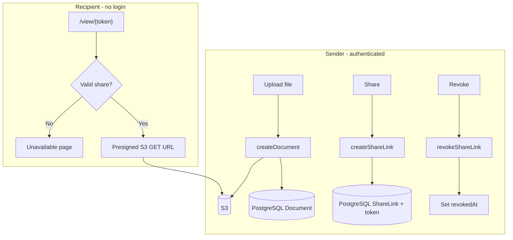

# SecureDoc — Secure Document Delivery SaaS

A lean MVP for **secure document delivery with revocable access**. Senders upload files, generate token-based share links, and can **revoke access at any time**—recipients see a dead link immediately, even if they saved the URL.

|                |                                                                                                                            |
| -------------- | -------------------------------------------------------------------------------------------------------------------------- |
| **Live demo**  | [https://secure-doc-delivery-saas.vercel.app](https://secure-doc-delivery-saas.vercel.app)                                 |
| **Repository** | [https://github.com/ShuvaMallickPro/secure-doc-delivery-saas](https://github.com/ShuvaMallickPro/secure-doc-delivery-saas) |

---

## Overview

SecureDoc separates **file storage** from **access control**:

- **Files** live in AWS S3 (private bucket, presigned URLs).
- **Permissions** live in PostgreSQL (who owns a document, which share links are active or revoked).
- **Recipients** open a public `/view/[token]` page—no account required—after the server validates the share.

This matches the Phase 1 MVP goal: Dropbox-style sharing with **post-send control** (revoke / optional expiry), not a full enterprise DMS.

---

## Features

| Feature                                              | Status     |
| ---------------------------------------------------- | ---------- |
| User authentication (Clerk)                          | ✅         |
| Document upload to S3 (presigned PUT)                | ✅         |
| Sender dashboard & document list                     | ✅         |
| Token-based share link generation                    | ✅         |
| Recipient view page (preview + download)             | ✅         |
| Instant revoke (soft revoke via `revokedAt`)         | ✅         |
| Link expiry (`expiresAt` supported in schema + view) | ✅         |
| Email notifications (Resend)                         | 🔲 Planned |
| View analytics / audit log                           | 🔲 Planned |

---

## How it works



1. **Upload** — Server Action verifies Clerk `userId`, issues a short-lived presigned upload URL, browser uploads directly to S3, then metadata is saved in `Document`.
2. **Share** — Owner creates a `ShareLink` with a random `token`; the app returns `https://your-app/view/{token}`.
3. **View** — Recipient hits the public route; the server checks revoke/expiry, then issues a presigned download URL (private bucket safe).
4. **Revoke** — Owner sets `revokedAt`; the next view request fails before any new S3 URL is issued.

---

## Tech stack

| Layer     | Technology                                                                 |
| --------- | -------------------------------------------------------------------------- |
| Framework | [Next.js 16](https://nextjs.org) (App Router)                              |
| Language  | TypeScript                                                                 |
| UI        | Tailwind CSS 4, [shadcn/ui](https://ui.shadcn.com)                         |
| Auth      | [Clerk](https://clerk.com)                                                 |
| Database  | PostgreSQL                                                                 |
| ORM       | [Prisma 7](https://www.prisma.io) (`prisma-client` + `@prisma/adapter-pg`) |
| Storage   | AWS S3 (`@aws-sdk/client-s3`, presigned URLs)                              |
| Hosting   | [Vercel](https://vercel.com)                                               |

---

## Project structure

```
├── actions/documents/       # Server Actions (upload, share, revoke)
├── app/
│   ├── (auth)/              # Login & signup (Clerk)
│   ├── (dashboard)/         # Protected dashboard & documents
│   └── view/[token]/        # Public recipient page
├── components/              # UI components
├── generated/prisma/        # Generated Prisma client (do not edit)
├── lib/
│   ├── prisma.ts            # Prisma singleton + PG adapter
│   └── s3.ts                # S3 client & presigned URLs
├── prisma/
│   ├── schema.prisma
│   └── migrations/
├── proxy.ts                 # Clerk middleware (public /view routes)
└── prisma.config.ts         # Prisma CLI datasource config
```

Server Actions are kept under `actions/` (see `components.json` alias `@/actions`) so server-only logic stays separate from UI routes.

---

## Database schema

**Document** — file metadata and S3 pointer (`s3Key`, `ownerId`).

**ShareLink** — access grant per recipient (`token`, `recipientEmail`, `revokedAt`, `expiresAt`).

```prisma
Document  1 ── * ShareLink
```

---

## Prerequisites

- **Node.js** 20.19+ (see Prisma 7 requirements)
- **PostgreSQL** database (e.g. [Neon](https://neon.tech), Prisma Postgres, or local)
- **AWS** account with S3 bucket + IAM credentials (`s3:PutObject`, `s3:GetObject`)
- **Clerk** application ([dashboard](https://dashboard.clerk.com))

---

## Environment variables

Create a `.env` file in the project root (never commit secrets):

```env
# Clerk
NEXT_PUBLIC_CLERK_PUBLISHABLE_KEY=
CLERK_SECRET_KEY=
NEXT_PUBLIC_CLERK_SIGN_IN_URL=/login
NEXT_PUBLIC_CLERK_SIGN_UP_URL=/signup
NEXT_PUBLIC_CLERK_AFTER_SIGN_IN_URL=/dashboard
NEXT_PUBLIC_CLERK_AFTER_SIGN_UP_URL=/dashboard

# Database (Prisma CLI + runtime)
DATABASE_URL="postgresql://..."

# AWS S3
AWS_REGION=
AWS_ACCESS_KEY_ID=
AWS_SECRET_ACCESS_KEY=
AWS_S3_BUCKET_NAME=

# App URL (used when building share links)
NEXT_PUBLIC_APP_URL=http://localhost:3000

# Email (optional — not wired in MVP yet)
RESEND_API_KEY=
```

For production on Vercel, set the same variables in the project settings and set `NEXT_PUBLIC_APP_URL` to `https://secure-doc-delivery-saas.vercel.app`.

---

## Local development

```bash
# Install dependencies
npm install

# Generate Prisma client (also runs on postinstall)
npx prisma generate

# Apply migrations
npx prisma migrate dev

# Start dev server
npm run dev
```

Open [http://localhost:3000](http://localhost:3000).

### Useful commands

| Command                  | Description                          |
| ------------------------ | ------------------------------------ |
| `npm run dev`            | Start Next.js dev server             |
| `npm run build`          | `prisma generate` + production build |
| `npm run start`          | Run production server locally        |
| `npm run lint`           | ESLint                               |
| `npx prisma studio`      | Browse database in UI                |
| `npx prisma migrate dev` | Create/apply migrations              |

---

## Deployment (Vercel)

1. Import the [GitHub repository](https://github.com/ShuvaMallickPro/secure-doc-delivery-saas) into Vercel.
2. Set **root directory** to this app folder if the repo is monorepo-nested; for a flat repo, use the default root.
3. Add all environment variables from the section above.
4. Deploy. `postinstall` runs `prisma generate`; ensure `DATABASE_URL` is reachable from Vercel.

**Build command:** `npm run build` (includes `prisma generate`).

---

## Security notes (MVP scope)

This demo prioritizes **proving revoke control**, not full enterprise hardening:

- Share links are **capability URLs**—anyone with the token can request access until revoked or expired.
- Recipient email is stored for display/watermark; **email verification is not enforced** on the view page.
- Use a **private S3 bucket** and presigned URLs (implemented for downloads).
- Rotate credentials if `.env` was ever exposed; keep `.env` out of Git (see `.gitignore`).

For production, consider: rate limiting on `/view/[token]`, audit logs, verified recipient email, shorter presign TTLs, and WAF rules.

---

## Roadmap

- [ ] Resend integration for share-link emails
- [ ] Recipient email input on share (replace demo placeholder)
- [ ] View count & `viewedAt` audit trail
- [ ] Configurable expiry when creating a share link
- [ ] Optional password or OTP on recipient page

---

## License

Private / portfolio MVP. All rights reserved unless otherwise specified by the project owner.

---

## Author

**Shuva Mallick** — [GitHub](https://github.com/ShuvaMallickPro)

Built as a secure document delivery MVP with revocable access control.
