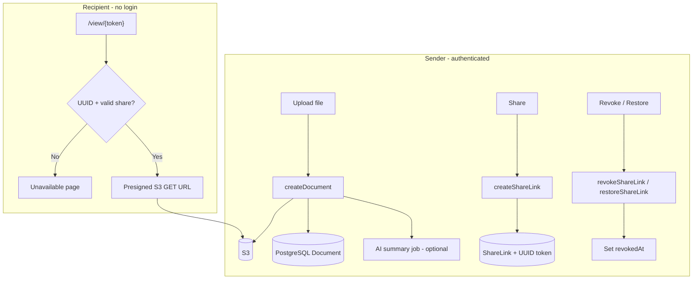
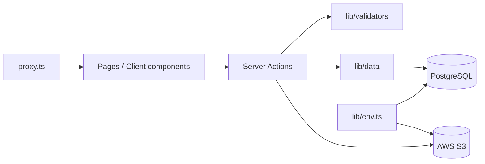

# SecureDoc — Secure Document Delivery SaaS

A lean MVP for **secure document delivery with revocable access**. Senders upload files, generate token-based share links per recipient, and can **revoke or restore access at any time**—recipients see a dead link immediately, even if they saved the URL.

|                |                                                                                                                            |
| -------------- | -------------------------------------------------------------------------------------------------------------------------- |
| **Live demo**  | [https://secure-doc-delivery-saas.vercel.app](https://secure-doc-delivery-saas.vercel.app)                                 |
| **Repository** | [https://github.com/ShuvaMallickPro/secure-doc-delivery-saas](https://github.com/ShuvaMallickPro/secure-doc-delivery-saas) |

---

## Overview

SecureDoc separates **file storage** from **access control**:

- **Files** live in AWS S3 (private bucket, presigned URLs).
- **Permissions** live in PostgreSQL (who owns a document, which share links are active or revoked).
- **Recipients** open a public `/view/[token]` page—no account required—after the server validates the share.

This matches the Phase 1 MVP goal: Dropbox-style sharing with **post-send control** (revoke / optional expiry), not a full enterprise DMS.

---

## Features

| Feature                                                          | Status     |
| ---------------------------------------------------------------- | ---------- |
| User authentication (Clerk)                                      | ✅         |
| Marketing landing page (B2B SaaS style)                          | ✅         |
| Dashboard with stats, sidebar shell, page headers                | ✅         |
| Document upload to S3 (presigned PUT)                            | ✅         |
| Upload validation (10 MB, MIME allowlist, filename sanitization) | ✅         |
| Sender dashboard & document list                                 | ✅         |
| Document delete (S3 object + DB + share links)                   | ✅         |
| Token-based share link generation (UUID)                         | ✅         |
| Recipient email on share (dialog + validation)                   | ✅         |
| Share link restore (undo revoke)                                 | ✅         |
| Recipient view page (preview + download + watermark)             | ✅         |
| Instant revoke (soft revoke via `revokedAt`)                     | ✅         |
| Link expiry (`expiresAt` supported in schema + view)             | ✅         |
| AI document summary (optional OpenAI, PDF/TXT)                   | ✅         |
| Zod validation at Server Action boundaries                       | ✅         |
| Data Access Layer (`lib/data/*`)                                 | ✅         |
| Env validation at startup (`lib/env.ts`)                         | ✅         |
| Content Security Policy + security headers                       | ✅         |
| Dashboard error boundary                                         | ✅         |
| Toast notifications (Sonner)                                     | ✅         |
| Settings page (placeholder)                                      | ✅         |
| Email notifications (Resend)                                     | 🔲 Planned |
| View analytics / audit log                                       | 🔲 Planned |
| Configurable expiry UI when creating a share                     | 🔲 Planned |
| Optional password or OTP on recipient page                       | 🔲 Planned |

---

## How it works



1. **Upload** — Server Action verifies Clerk `userId`, validates file type/size, issues a short-lived presigned upload URL, browser uploads directly to S3, then metadata is saved via the DAL. An optional background job generates an AI summary.
2. **Share** — Owner creates a `ShareLink` with a UUID `token` and recipient email; the app returns `https://your-app/view/{token}`.
3. **View** — Recipient hits the public route; the server validates UUID format, checks revoke/expiry, then issues a presigned download URL (private bucket safe).
4. **Revoke / restore** — Owner sets or clears `revokedAt`; the next view request fails or succeeds accordingly before any new S3 URL is issued.

---

## Tech stack

| Layer         | Technology                                                                             |
| ------------- | -------------------------------------------------------------------------------------- |
| Framework     | [Next.js 16](https://nextjs.org) (App Router)                                          |
| Language      | TypeScript                                                                             |
| UI            | Tailwind CSS 4, [shadcn/ui](https://ui.shadcn.com), Lucide icons                       |
| Auth          | [Clerk](https://clerk.com) v7                                                          |
| Validation    | [Zod 4](https://zod.dev)                                                               |
| Database      | PostgreSQL                                                                             |
| ORM           | [Prisma 7](https://www.prisma.io) (`prisma-client` + `@prisma/adapter-pg` + `pg` Pool) |
| Storage       | AWS S3 (`@aws-sdk/client-s3`, presigned URLs)                                          |
| AI (optional) | OpenAI (`gpt-4o-mini` default) for document summaries                                  |
| Toasts        | [Sonner](https://sonner.emilkowal.ski)                                                 |
| Hosting       | [Vercel](https://vercel.com)                                                           |

---

## Project structure

```
├── actions/documents/          # Server Actions (auth + validate + DAL)
│   ├── create-document.ts
│   ├── create-share-link.ts
│   ├── revoke-share-link.ts
│   ├── restore-share-link.ts
│   ├── delete-document.ts
│   └── generate-document-summary.ts
├── app/
│   ├── page.tsx                # Marketing landing (force-dynamic)
│   ├── layout.tsx              # ClerkProvider, metadata, Toaster
│   ├── (auth)/                 # Login & signup (Clerk)
│   ├── (dashboard)/            # Protected dashboard shell
│   │   ├── error.tsx           # Dashboard error boundary
│   │   └── dashboard/
│   │       ├── page.tsx        # Overview + stats
│   │       ├── documents/      # Upload, list, share, revoke
│   │       └── settings/       # Placeholder
│   └── view/[token]/           # Public recipient page
├── components/
│   ├── marketing/              # Landing page sections
│   ├── dashboard/              # Shell, sidebar, header, PageHeader
│   ├── documents/              # List, dialogs, shares panel, AI summary
│   └── ui/                     # shadcn primitives
├── generated/prisma/           # Generated Prisma client (do not edit)
├── lib/
│   ├── data/                   # Data Access Layer (documents, share-links)
│   ├── validators/             # Zod schemas (documents, share token)
│   ├── env.ts                  # Startup env validation
│   ├── clerk-appearance.ts     # Global Clerk theme (solid panels)
│   ├── prisma.ts               # Prisma + PG adapter (server-only)
│   ├── s3.ts                   # S3 client & presigned URLs (server-only)
│   ├── document-summary.ts     # OpenAI summary job (server-only)
│   ├── share-utils.ts
│   └── toast.ts
├── prisma/
│   ├── schema.prisma
│   └── migrations/
├── instrumentation.ts          # Loads lib/env at server startup
├── proxy.ts                    # Clerk middleware + public route allowlist
├── next.config.ts              # CSP, security headers, 10 MB Server Actions
└── prisma.config.ts            # Prisma CLI datasource config
```

Server Actions live under `actions/` (alias `@/actions`) so server-only logic stays separate from UI routes. Database reads/writes go through `lib/data/*` rather than direct `prisma` calls in pages and actions.

---

## Architecture



**Security patterns in place:**

- **Middleware** — `proxy.ts` protects all routes except documented public paths (`/`, `/login`, `/signup`, `/view/*`, `/__clerk/*`).
- **Server Actions** — Every action calls `auth()`, throws if unauthenticated, then verifies ownership via `ownerId` / DAL helpers (never relies on layout alone).
- **Public view route** — Share token validated as UUID before DB lookup; revoked/expired links fail closed.
- **Upload** — Client + server validation: 10 MB max, MIME allowlist, blocked extensions, sanitized filenames.
- **CSP** — Content-Security-Policy allows Clerk and AWS domains; see `next.config.ts`.

---

## Database schema

**Document** — file metadata, S3 pointer (`s3Key`, `ownerId`), optional AI summary fields.

**ShareLink** — access grant per recipient (`token` UUID, `recipientEmail`, `revokedAt`, `expiresAt`).

```prisma
Document  1 ── * ShareLink
```

| Document field    | Purpose                                    |
| ----------------- | ------------------------------------------ |
| `aiSummary`       | Generated summary text                     |
| `aiSummaryStatus` | `pending` / `ready` / `failed` / `skipped` |
| `aiSummaryError`  | Error message when summary fails           |

---

## Prerequisites

- **Node.js** 20.19+ (see Prisma 7 requirements)
- **PostgreSQL** database (e.g. [Neon](https://neon.tech), Prisma Postgres, or local)
- **AWS** account with S3 bucket + IAM credentials (`s3:PutObject`, `s3:GetObject`, `s3:DeleteObject`)
- **Clerk** application ([dashboard](https://dashboard.clerk.com))
- **OpenAI** API key (optional — for AI summaries)

---

## Environment variables

Create a `.env` file in the project root (never commit secrets):

```env
# Clerk
NEXT_PUBLIC_CLERK_PUBLISHABLE_KEY=
CLERK_SECRET_KEY=
NEXT_PUBLIC_CLERK_SIGN_IN_URL=/login
NEXT_PUBLIC_CLERK_SIGN_UP_URL=/signup
NEXT_PUBLIC_CLERK_SIGN_IN_FALLBACK_REDIRECT_URL=/dashboard
NEXT_PUBLIC_CLERK_SIGN_UP_FALLBACK_REDIRECT_URL=/dashboard

# Database (Prisma CLI + runtime)
DATABASE_URL="postgresql://..."

# AWS S3
AWS_REGION=
AWS_ACCESS_KEY_ID=
AWS_SECRET_ACCESS_KEY=
AWS_S3_BUCKET_NAME=

# App URL (used when building share links)
NEXT_PUBLIC_APP_URL=http://localhost:3000

# OpenAI (optional — AI document summaries)
OPENAI_API_KEY=
OPENAI_MODEL=gpt-4o-mini

# Email (optional — not wired yet)
RESEND_API_KEY=
```

Required variables are validated at startup via `lib/env.ts` (loaded through `instrumentation.ts`). Missing or invalid values fail fast with a clear error message.

For production on Vercel, set the same variables in the project settings and set `NEXT_PUBLIC_APP_URL` to `https://secure-doc-delivery-saas.vercel.app`.

---

## Local development

```bash
# Install dependencies
npm install

# Generate Prisma client (also runs on postinstall)
npx prisma generate

# Apply migrations
npx prisma migrate dev

# Start dev server
npm run dev
```

Open [http://localhost:3000](http://localhost:3000).

### Useful commands

| Command                  | Description                          |
| ------------------------ | ------------------------------------ |
| `npm run dev`            | Start Next.js dev server             |
| `npm run build`          | `prisma generate` + production build |
| `npm run start`          | Run production server locally        |
| `npm run lint`           | ESLint                               |
| `npx tsc --noEmit`       | TypeScript check                     |
| `npx prisma studio`      | Browse database in UI                |
| `npx prisma migrate dev` | Create/apply migrations              |

---

## Deployment (Vercel)

1. Import the [GitHub repository](https://github.com/ShuvaMallickPro/secure-doc-delivery-saas) into Vercel.
2. Set **root directory** to this app folder if the repo is monorepo-nested; for a flat repo, use the default root.
3. Add all environment variables from the section above.
4. Deploy. `postinstall` runs `prisma generate`; ensure `DATABASE_URL` is reachable from Vercel.

**Build command:** `npm run build` (includes `prisma generate`).

After changing `next.config.ts` (CSP headers), redeploy for headers to take effect.

---

## UI & UX highlights

- **Marketing page** — Hero, features, how-it-works, CTA; auth-aware buttons (`components/marketing/`).
- **Dashboard shell** — Collapsible sidebar, sticky header with centered search (desktop), Clerk `UserButton`.
- **Page headers** — Reusable `PageHeader` / `PageHeading` / `PageDescription` for consistent page titles.
- **Document list** — Upload form, share dialog, expandable share links panel, delete confirmation, AI summary badges.
- **Mutations** — `router.refresh()` after Server Actions (no full page reload); Sonner toasts for feedback.
- **Clerk theming** — Solid modal/popover backgrounds via `lib/clerk-appearance.ts` (matches app oklch tokens).

---

## Security notes (MVP scope)

This demo prioritizes **proving revoke control** and **solid App Router patterns**, not full enterprise hardening:

- Share links are **capability URLs**—anyone with the token can request access until revoked or expired.
- Recipient email is stored for display/watermark; **email verification is not enforced** on the view page.
- Use a **private S3 bucket** and presigned URLs (implemented for upload/download/delete).
- Server Actions enforce **auth + ownership** on every mutation; middleware is the front door, actions are the vault.
- Rotate credentials if `.env` was ever exposed; keep `.env` out of Git (see `.gitignore`).

For production, consider: rate limiting on `/view/[token]`, audit logs, verified recipient email, shorter presign TTLs, and WAF rules.

---

## Roadmap

- [x] Marketing landing page
- [x] Recipient email on share
- [x] Document delete
- [x] Share link restore
- [x] Zod validation + upload security
- [x] Data Access Layer
- [x] AI document summary (optional)
- [x] Env validation, CSP, error boundaries
- [ ] Resend integration for share-link emails
- [ ] View count & `viewedAt` audit trail
- [ ] Configurable expiry when creating a share link
- [ ] Optional password or OTP on recipient page
- [ ] Full settings page (account / workspace preferences)

---

## License

Private / portfolio MVP. All rights reserved unless otherwise specified by the project owner.

---

## Author

**Shuva Mallick** — [GitHub](https://github.com/ShuvaMallickPro)

Built as a secure document delivery MVP with revocable access control.
